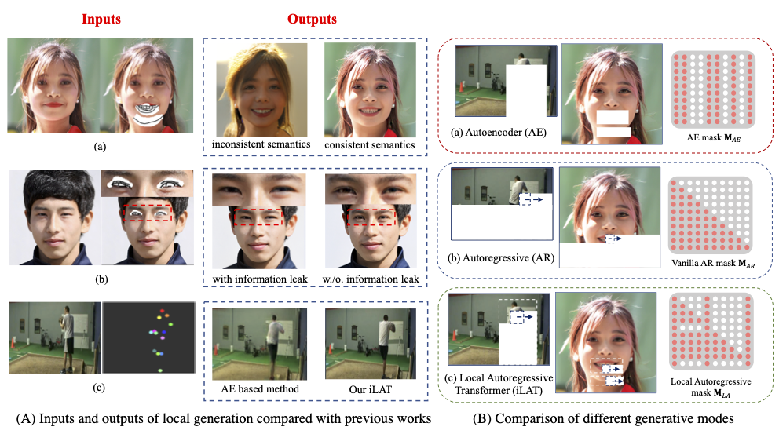
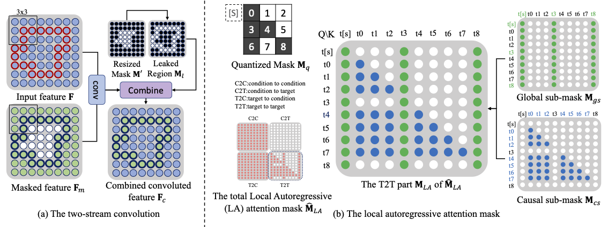

# The Image Local Autoregressive Transformer (NeurIPS 2021)

[arXiv paper](https://arxiv.org/abs/2106.02514)



## Overview
We propose the two-stream convolution and the local autoregressive mask to maintain the image consistence without information leakage.



### News
- [x] Release the training codes.
- [ ] Codes for pose editing.

### Requirements
These codes are only tested in pytorch==1.3.1.

### Preparation
1. Download the pretrained [sketch-vqgan](https://drive.google.com/file/d/1oz34ABOmukoQ8fV02A8bjumtKe1g5ONQ/view?usp=sharing), [image-vqgan](https://drive.google.com/file/d/1pDEs-43JNd30W-ptQhKWSrT5emN3wn6z/view?usp=sharing), and [transformer](https://drive.google.com/file/d/1jeF5F6RzCgLC7-jccgp0eWdJOsNmSqD8/view?usp=sharing). 
2. For masked training, we provide irregular and segmentation masks ([download](https://drive.google.com/drive/folders/1eU6VaTWGdgCXXWueCXilt6oxHdONgUgf?usp=sharing)) with different masking rates. And you should define the mask file list before the training (flist_example.txt).

### Training

The TS-VQGAN is designed a little different from VQGAN, which can trained with less GPU memory with the same performance.
> 1. Remove attentions.
> 
> 2. Using InstanceNorm instead of GroupNorm.
> 
> 3. Progressive channel widths.
> 
> 4. Fewer parameters for the sketch vqgan.

1. Generating XDoG sketches.
```
python generate_xdog_sketch.py --input_path  --output_path <output fold>
```

2. Train sketch VQGAN.
```
python train_sketch_vqgan.py --path <model path> --config_path configs/vqgan_ffhq.yml --max_iters 150000 --learning_rate 1e-4 --gpu 0
```

3. Train image TS-VQGAN.
```
python train_image_tsvqgan.py --path <model path> --config_path configs/vqgan_ffhq.yml --max_iters 150000 --learning_rate 2e-4 --gpu 0
python train_image_tsvqgan.py --path <model path> --config_path configs/vqgan_ffhq.yml --max_iters 300000 --learning_rate 4e-5 --gpu 0 --finetune
```

4. Train the iLAT.
```
python train_transformer.py --path <model path> --config_path configs/transformer_ffhq.yml \
                            --sketch_model_path <sketch-VQGAN path> \
                            --image_model_path <image-VQGAN path> \
                            --max_iters 300000 --learning_rate 5e-5 --gpu 3
```

### Testing

See face_editing_demo.ipynb.